# MoneyTuber — Visual Appendix

**Purpose:** Binder-ready figures and screenshots with captions  
**Caption rule:** Prefer LIVE captures; plates below marked ILLUSTRATIVE unless noted  

---

## Binder insert order

| Order | File | Caption |
|------:|------|---------|
| 1 | `figures/fig-01-end-to-end-flow.png` | Fig 1 — End-to-end MoneyTuber platform flow |
| 2 | `figures/fig-02-architecture.png` | Fig 2 — System architecture (single Render service) |
| 3 | `figures/fig-03-modules.png` | Fig 3 — Capabilities → operational outcomes |
| 4 | `figures/fig-04-integrity.png` | Fig 4 — Integrity safeguards |
| 5 | `screenshots/01-landing.png` | Landing — MoneyTuber public pillars (**ILLUSTRATIVE**) |
| 6 | `screenshots/02-login.png` | Login (**ILLUSTRATIVE**) |
| 7 | `screenshots/03-admin-dashboard.png` | Admin dashboard (**ILLUSTRATIVE** demo rows) |
| 8 | `screenshots/04-suggestions-queue.png` | Suggestions review queue (**ILLUSTRATIVE**) |
| 9 | `screenshots/05-marketplace.png` | Marketplace browse (**ILLUSTRATIVE** listings) |
| 10 | `screenshots/06-clipper-tool.png` | Clipper UI — vendor plate mounted at `/clip` |
| 11 | `screenshots/07-affiliate.png` | Affiliate dashboard (**ILLUSTRATIVE**) |
| 12 | `screenshots/08-source-license-status.png` | Source/licensing discovery status |

---

## Diagrams

### Figure 1 — End-to-end flow

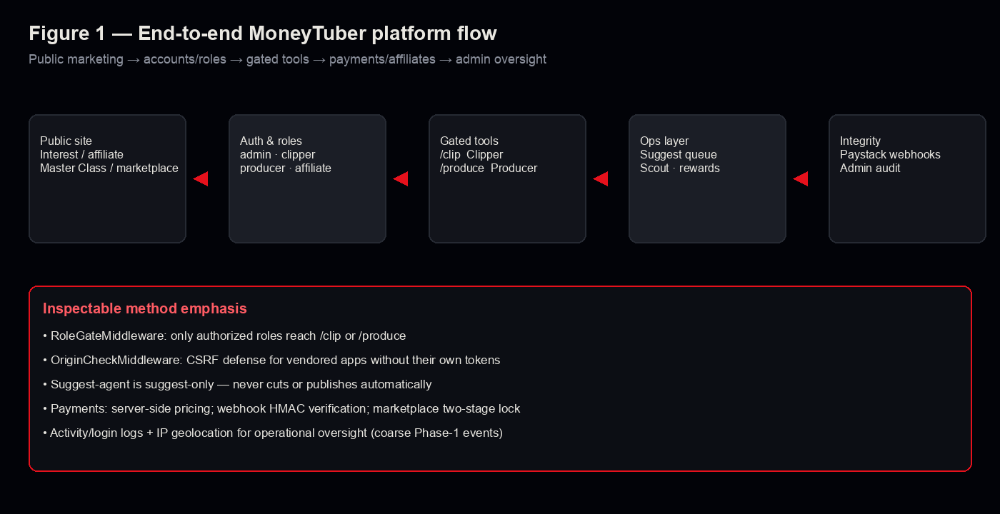

Public marketing and intake → authentication/roles → gated `/clip` & `/produce` → ops (suggestions, scout, rewards) → payment/admin integrity layer.

### Figure 2 — Architecture

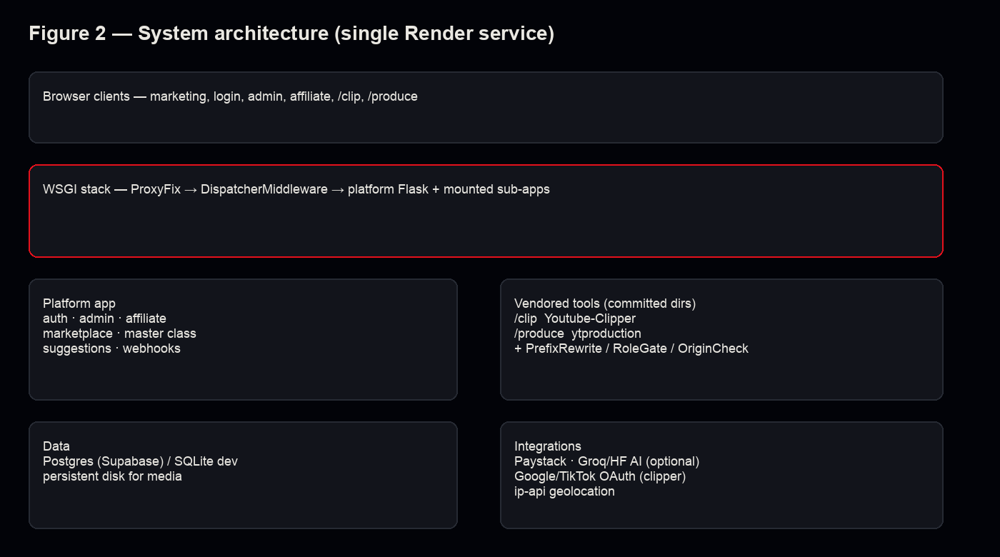

Browser clients over a WSGI stack assembling the platform Flask app with vendored mounts, Postgres/disk, and Paystack/AI/OAuth/geo integrations.

### Figure 3 — Modules → outcomes

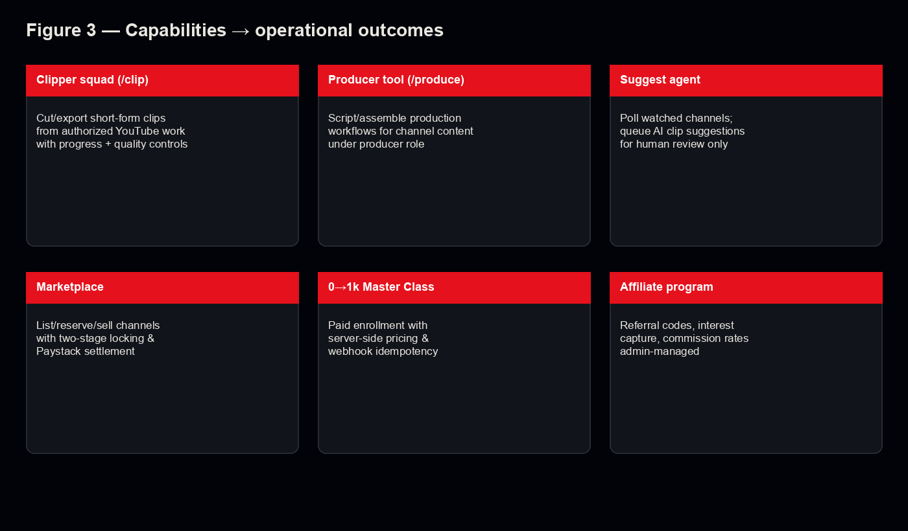

Clipper, producer, suggest-agent, marketplace, Master Class, and affiliate program mapped to operational outcomes.

### Figure 4 — Integrity safeguards

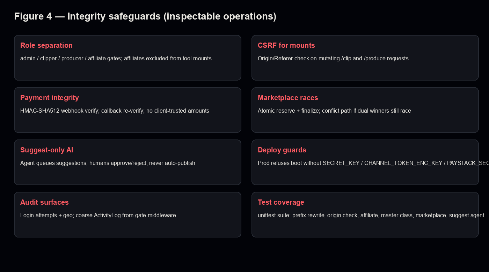

Role separation, CSRF-for-mounts, payment HMAC, marketplace locking, suggest-only AI, deploy secret guards, audit surfaces, tests.

---

## Screenshots

### 01 — Landing (**ILLUSTRATIVE**)

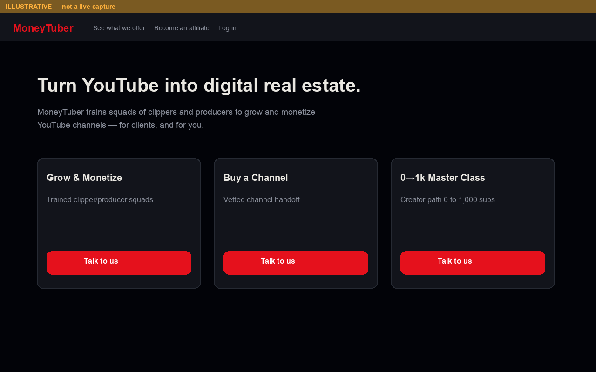

Matches public copy: “Turn YouTube into digital real estate” and three pillars.

### 02 — Login (**ILLUSTRATIVE**)

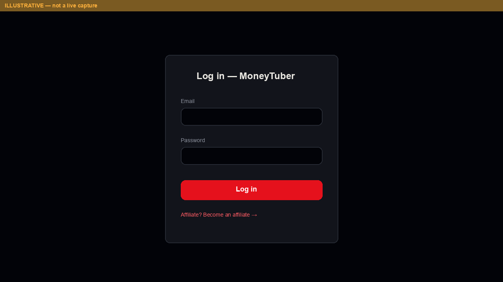

### 03 — Admin dashboard (**ILLUSTRATIVE**)

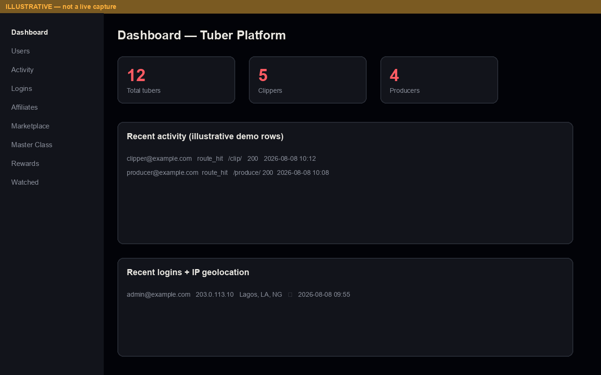

Counts and table rows are demo placeholders — not production findings.

### 04 — Suggestions queue (**ILLUSTRATIVE**)

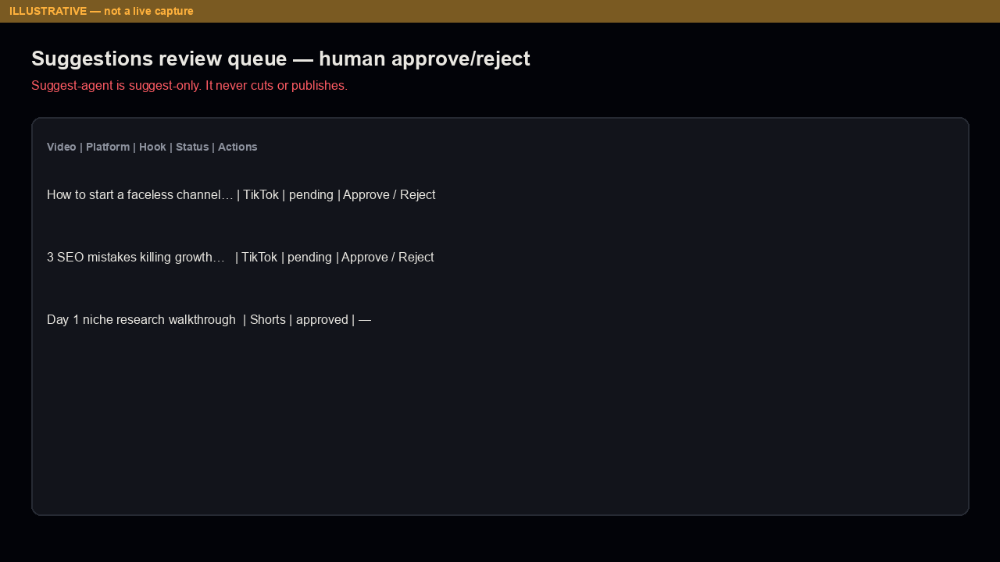

Emphasizes human approve/reject.

### 05 — Marketplace (**ILLUSTRATIVE**)

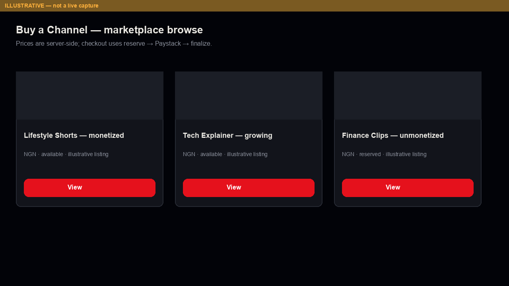

### 06 — Clipper tool

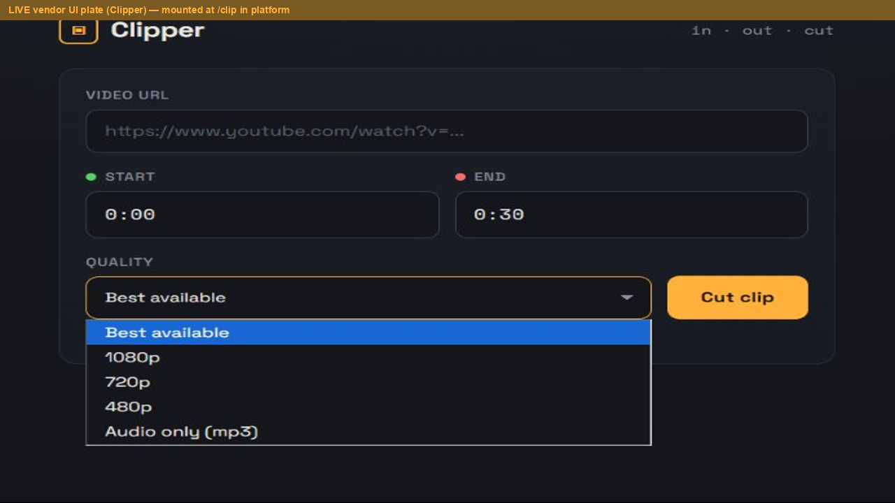

Derived from vendored Clipper screenshot assets; in platform context this UI is served under `/clip` for authorized roles.

### 07 — Affiliate (**ILLUSTRATIVE**)

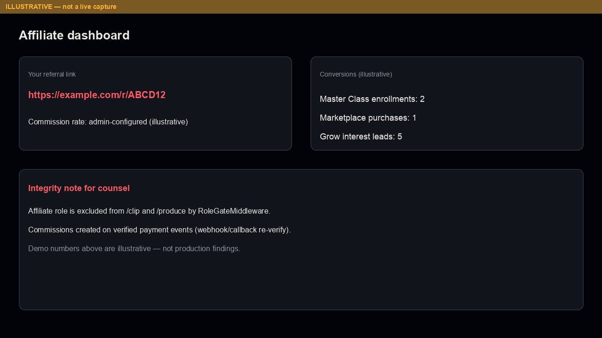

### 08 — Source / license status

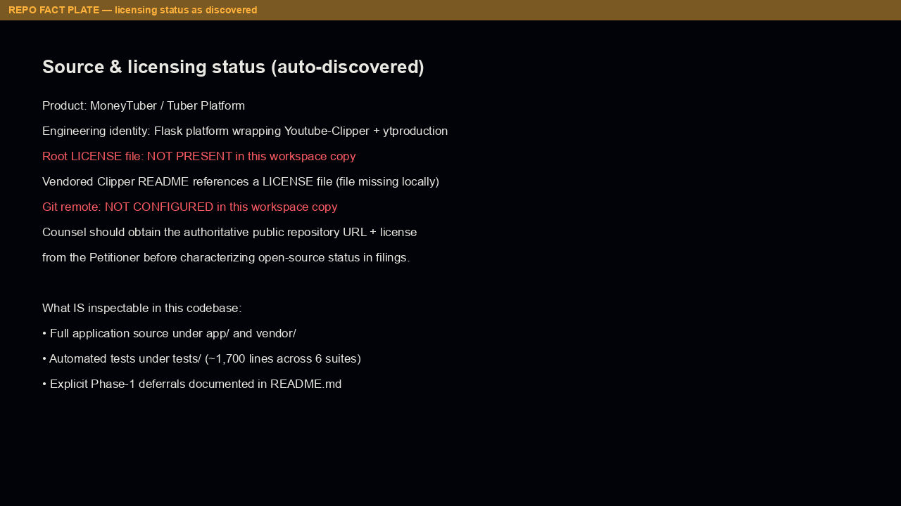

Honest discovery plate: no root LICENSE / no git remote in this workspace copy.

---

## Note on LIVE vs ILLUSTRATIVE

Replace ILLUSTRATIVE plates with LIVE staging/production captures when counsel schedules a controlled demo. Keep banners until replacement. Never present illustrative commerce metrics as audited results.
