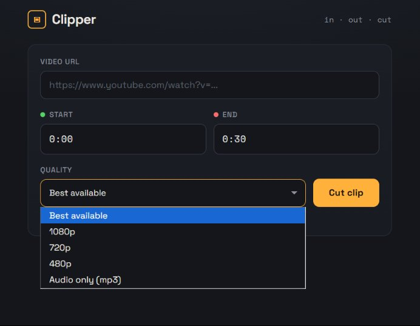
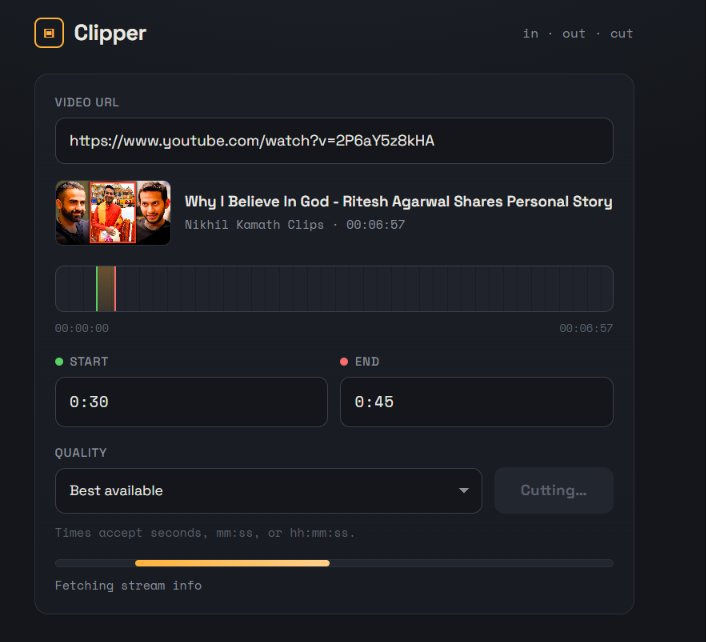
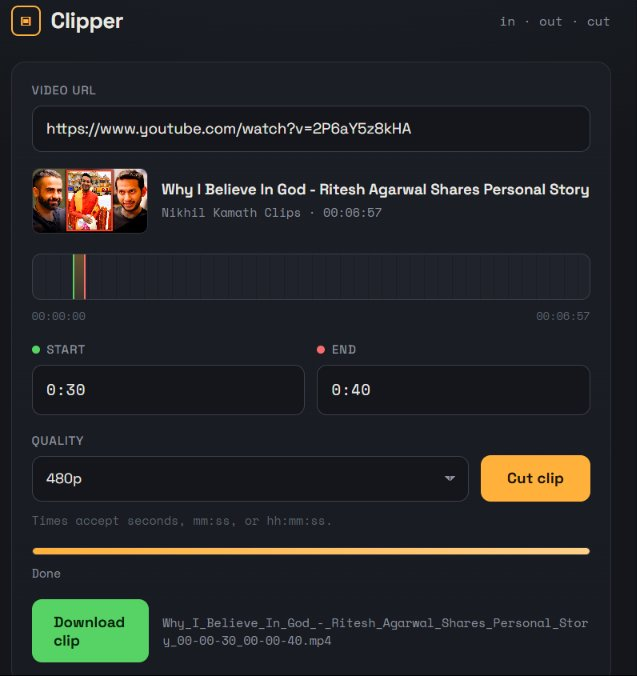

# Clipper

A tiny local web app to cut a segment out of a YouTube video. Paste a URL, set in/out timecodes, hit **Cut** — it grabs only the section you asked for (not the whole video) and gives you a downloadable clip.

Runs entirely on your own machine. Powered by [yt-dlp](https://github.com/yt-dlp/yt-dlp) and [ffmpeg](https://ffmpeg.org).



## Features

- **Clip by timecode** — type a start and end (seconds, `mm:ss`, or `hh:mm:ss`) and get just that slice.
- **Section-only download** — uses yt-dlp's `download_sections`, so long videos don't download in full.
- **Live preview** — paste a URL and it pulls the title, thumbnail, duration, and a timeline strip showing your in/out selection.
- **Live progress** — a real progress bar streams download and merge status as it works.
- **Quality choices** — best available, 1080p, 720p, 480p, or audio-only (mp3).
- **Single file** — backend and the whole UI live in one `app.py`. No build step.

## Screenshots

Paste a URL and pick your settings:



When it's done, download your clip:



## Requirements

- Python 3.8+
- [ffmpeg](https://ffmpeg.org/download.html) installed and on your `PATH` (needed for cutting and merging)

## Install

```bash
git clone https://github.com/YOUR_USERNAME/clipper.git
cd clipper
pip install -r requirements.txt
```

Install ffmpeg if you don't have it:

```bash
# macOS
brew install ffmpeg
# Ubuntu / Debian
sudo apt install ffmpeg
# Windows
choco install ffmpeg
```

## Run

```bash
python app.py
```

Then open **http://127.0.0.1:5000** in your browser.

## Usage

1. Paste a video URL — the title, thumbnail, and duration appear automatically.
2. Set the **Start** and **End** times (seconds, `mm:ss`, or `hh:mm:ss`).
3. Pick a quality.
4. Click **Cut clip** and watch the progress bar.
5. Hit **Download clip** when it finishes. Clips are also saved to a local `clips/` folder.

## Notes

- **Frame-accurate vs. fast cuts:** by default the app re-encodes around the cut points (`force_keyframes_at_cuts`) so the clip starts exactly on your timestamp. That re-encode is the slow part. Removing it makes cuts near-instant but they snap to the nearest keyframe (within a second or two of your time).
- **Keep yt-dlp updated:** YouTube changes often, so if downloads start failing, run `pip install -U yt-dlp` first.
- This runs on Flask's development server, which is fine for local use. For anything public you'd put it behind a production WSGI server.

## Legal

Downloading content from YouTube may conflict with YouTube's Terms of Service and copyright law depending on what you download and where you are. Use this only for content you own or have the rights to. You are responsible for how you use it.

## License

See [LICENSE](LICENSE).
